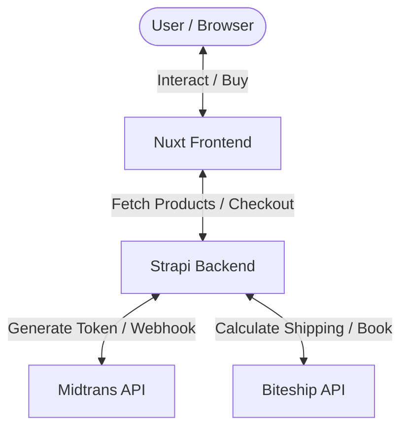

# Spec: Generic Single-Store E-Commerce Boilerplate (Ready-to-Fork)

## Objective

Membangun template/boilerplate e-commerce generic siap-fork dengan integrasi logistik Biteship dan payment gateway Midtrans. Backend (Strapi) bertindak sebagai koordinator transaksi dan integrasi API eksternal, sementara Frontend (Nuxt) berfokus pada rendering UI, pengelolaan keranjang belanja (cart), dan halaman checkout.

## High-Level Architecture



## System Components

### 1. Backend: Strapi (v5)

Mengelola database, API endpoint, dan integrasi pihak ketiga:

- **Product Management**: Manajemen katalog, kategori, stok, dan dimensi produk (berat, dimensi untuk kalkulasi Biteship).
- **Order Management**: Menyimpan riwayat order, status pembayaran, dan status pengiriman.
- **Biteship Integration Service**:
  - Endpoint untuk meneruskan alamat pengiriman dan mendapatkan opsi kurir + ongkir.
  - Logika booking kurir jika diperlukan.
- **Midtrans Integration Service**:
  - Endpoint untuk membuat transaksi Snap Token.
  - Endpoint webhook untuk memproses notifikasi status pembayaran dari Midtrans.

### 2. Frontend: Nuxt (v4)

Menampilkan antarmuka yang cepat dan interaktif:

- **Katalog & Detail Produk**: Halaman responsif untuk memamerkan produk dan kategori.
- **Cart System**: Pengelolaan keranjang belanja di sisi client (local storage persistence).
- **Checkout Flow**:
  - Form pengiriman (nama, telepon, alamat).
  - Integrasi pencarian area Biteship (kecamatan/kota).
  - Tampilan pilihan kurir & ongkir.
  - Integrasi Midtrans Snap Popup.
- **Order Confirmation**: Halaman sukses/gagal pembayaran serta peninjauan order.

## High-Level Integration Flows

### A. Alur Kalkulasi Ongkir (Biteship)

1. User melengkapi form alamat di halaman Checkout Nuxt.
2. Nuxt mengirimkan detail alamat ke Strapi endpoint `/api/orders/shipping-rates`.
3. Strapi meneruskan request ke API Biteship menggunakan API Key yang aman.
4. Biteship mengembalikan daftar kurir beserta harga ongkirnya.
5. Strapi mengembalikan opsi tersebut ke Nuxt untuk ditampilkan kepada User.

### B. Alur Pembayaran (Midtrans)

1. User memilih kurir dan mengklik tombol "Bayar".
2. Nuxt mengirim data order (produk, alamat, kurir pilihan) ke Strapi `/api/orders/checkout`.
3. Strapi membuat record order dengan status `pending`, menghitung total harga (produk + ongkir), lalu memanggil API Midtrans untuk membuat **Snap Token**.
4. Strapi mengembalikan Snap Token ke Nuxt.
5. Nuxt membuka popup Midtrans Snap di browser User.
6. User menyelesaikan pembayaran.
7. Midtrans mengirimkan notifikasi webhook ke Strapi `/api/orders/webhook`.
8. Strapi memverifikasi signature dan mengubah status order menjadi `paid` (atau `failed` / `cancelled`).

## Project Structure (High-Level)

```
e-commerce/
├── apps/
│   ├── backend/             → Strapi v5 application
│   │   └── src/api/         → Collection Types (product, order, address, etc.) & Custom API
│   └── web/                 → Nuxt v4 application
│       ├── app/
│       │   ├── pages/       → Pages (index, products, checkout, success)
│       │   └── composables/ → State Management (cart, checkout)
│       └── server/          → Webhook endpoints (if proxying is needed)
```

## Boundaries

- **Always**: Simpan seluruh kredensial API (Midtrans Server Key, Biteship API Key) di `.env` backend. Pastikan harga dihitung ulang di backend untuk menghindari manipulasi harga dari client.
- **Ask First**: Mengubah database schema untuk Collection Types yang sudah ada.
- **Never**: Menaruh kredensial backend di codebase frontend.

## Success Criteria

- [ ] Katalog produk dapat di-render di Nuxt dari Strapi.
- [ ] Ongkir Biteship terhitung otomatis berdasarkan alamat pengiriman yang diinput user.
- [ ] Midtrans Snap Popup muncul saat tombol pembayaran diklik di Nuxt.
- [ ] Webhook Midtrans berhasil mengubah status order di Strapi dari `pending` menjadi `paid`.
- [ ] Seluruh kode ditulis dengan rapi, modular, dan siap difork/dikustomisasi dengan mudah oleh developer lain.
